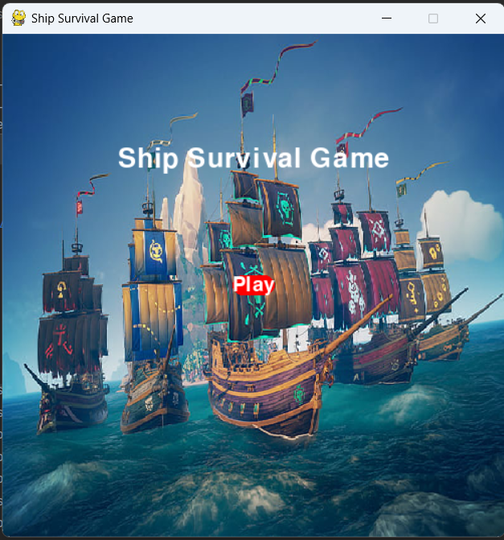
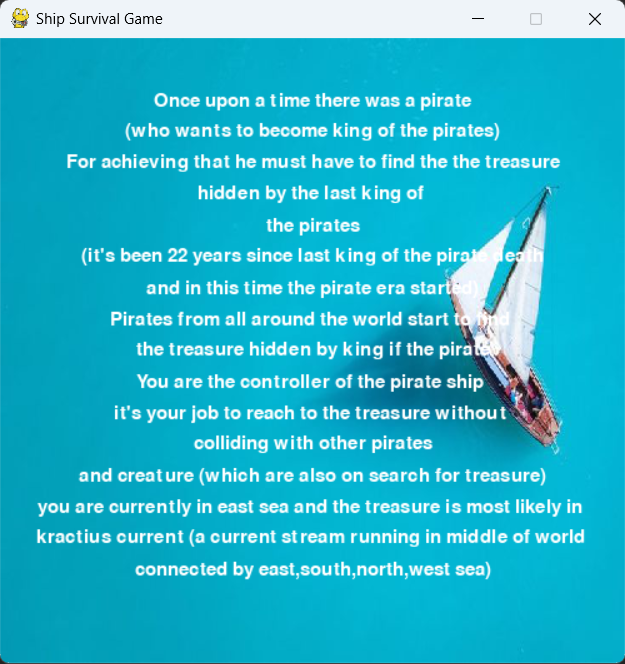

# Ship Survival Game

Welcome to the "Ship Survival Game"! In this innovative game, you take control of a pirate ship on a quest to find a hidden treasure. Your journey will take you through challenging seas filled with other pirates and dangerous creatures. Use your hand gestures to navigate the ship, avoid collisions, and reach the treasure.

# Game Innovation

The game introduces a unique control mechanism using hand gestures captured through a camera using OpenCV. The player can control the ship's movement left and right based on the hand gestures(open hand and fist) recognized by the system. The game also features an immersive story that unfolds as you progress through different levels.

# Game Story
# Level 1

# Gameplay
## Controls:
-  Use hand gestures to control the ship.
-  Fist Gesture: Move the ship left.
- Open Hand Gesture: Move the ship right.
## Objective: 
- Reach the treasure without colliding with other pirates and creatures. Score points by avoiding collisions and progressing through levels.

## Scoring:
- Earn points by avoiding collisions with enemy ships. The game becomes more challenging as you progress.

## How to play
- Run the game script.
- The main menu will appear.
- Click the "Play" button to start the game.
- Follow the on-screen instructions to navigate the ship using hand gestures.
- Reach the treasure to advance to the next level.
- Watch out for enemy ships and creatures – avoid collisions!
- If your ship collides, the game will display a game over screen.
- You can choose to play again (press 'Y') or exit (press 'N').

# Technical Details
The game is implemented in Python using the Pygame library for graphics and input handling. OpenCV is employed for hand gesture recognition, allowing players to control the ship through webcam input.

# Hand Gesture Recognition Method
The game leverages OpenCV for hand gesture recognition. The relevant function, imageFiltering, performs the following steps:

## ROI Extraction:
- Extracts the Region of Interest (ROI) from the webcam frame based on specified coordinates (x, y, w, h).
## Image Preprocessing:
- Applies Gaussian blur to reduce noise.
- Converts the image from colored to HSV (Hue, Saturation, Value).
- Applies a mask to isolate skin color.
## Contour Detection:
- Finds contours in the thresholded image.
- Utilizes convex hull and convexity defects for hand gesture analysis.
## Gesture Recognition:
- Detects the number of defects in the hand gesture(more defects likely to be fist).
- Determines if the gesture represents a fist or an open hand.

# Dependencies
- Python
- Pygame
- OpenCV 

